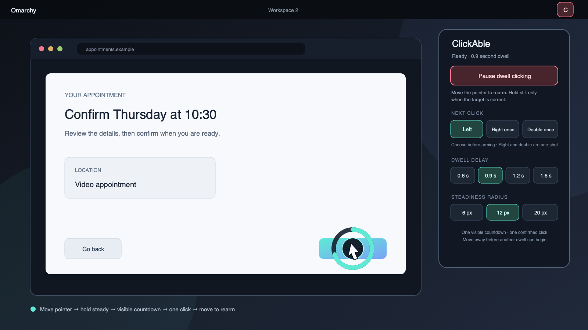

# ClickAble for Omarchy

If you can point, you should be able to click.

ClickAble turns a deliberate pointer pause into a click. It is built for people who can position a pointer with an eye tracker, head tracker, trackball, mouse, or other device but cannot press a button reliably or comfortably.

Arm it once with an accessible key, external switch, keyboard navigation, or a conventional click. After that, the pointer can click and can dwell on the ClickAble bar widget to Pause. Users who cannot produce any conventional click need the [single-key or switch setup](docs/SETUP.md#recommended-single-key-or-switch-control) before ClickAble can be their click path.

Move to a target. Hold still. A ring shows the countdown. ClickAble clicks once, then waits for you to move away before it can click again.



## What it does

- Performs an ordinary left click after a visible dwell countdown.
- Offers one-shot right and double clicks, then returns to left click.
- Cancels non-positional activity detected while the pointer is stationary and pointer movement beyond the selected tolerance; small involuntary motion can preserve progress, but a click still waits for a quiet input interval.
- Requires movement after arming and after every click, preventing click loops at a resting pointer.
- Blocks clicks while Omarchy is locked or the desktop scene is changing.
- Pauses on helper, protocol, or uncertain click failures.
- Shows one unmistakable armed/paused state in the Omarchy bar.
- Works without administrator privileges, virtual input devices, a background daemon, or Hyprland configuration changes.

ClickAble starts paused every time it loads. It never remembers an armed state across a shell restart, plugin reload, or login.

## Try it

Omarchy plugins run inside the long-lived shell without a sandbox, so review this repository before installing it.

```bash
omarchy plugin add https://github.com/josephbriones/omarchy-clickable.git --enable
omarchy-shell clickable demo
```

The deterministic demo exercises the same state machine and countdown without sending a click to Hyprland.

## Use it

Open the ClickAble bar control and choose **Arm ClickAble**. The initial move-away guard is intentional: move the pointer once after arming, then settle over the target you want.

The normal cycle is deliberately short:

1. Move to a target.
2. Hold still while the ring completes.
3. ClickAble sends one click.
4. Move away before another dwell can begin.

Choose the next action before arming. Left stays selected. Right and double are one-shot actions: dwell on the target and ClickAble returns to left after the requested click succeeds. A safety fault also returns to left instead of silently retrying an uncertain action.

Dwell on the ClickAble bar widget while it is armed to pause it. A keyboard, switch, or script can use the same service directly:

```bash
omarchy-shell clickable toggle
omarchy-shell clickable arm
omarchy-shell clickable pause
omarchy-shell clickable left
omarchy-shell clickable right
omarchy-shell clickable double
omarchy-shell clickable state
```

These commands make it practical to bind Arm/Pause to one accessible key or external switch without requiring a chord.

## Deliberately small

ClickAble is a dwell clicker, not a replacement input stack.

- No drag, scroll, hover menu, target snapping, or on-screen keyboard in v1.
- No continuous desktop capture, accessibility-tree inspection, key logging, or text collection.
- No kernel input injection, device rule, elevated service, native Hyprland extension, or automatic configuration edit.
- No automatic arming, hidden autostart state, analytics, account, or network request.

The narrow scope is a safety decision. A simple click that users can predict is more useful than a long feature list they cannot trust.

## Privacy

While armed, ClickAble asks the local Hyprland session for the pointer position and lock state. Omarchy's idle monitor reports only whether user input occurred; ClickAble does not receive the key, button, or text involved. Coordinates and countdown state remain in memory and are discarded when paused or stopped.

Only bounded presentation preferences are retained. ClickAble creates no click history, pointer trail, screenshot, recording, analytics event, or network request. [Privacy](PRIVACY.md) documents the exact boundary.

## Compatibility and limits

ClickAble targets current Omarchy Quattro and its pinned Hyprland integration. The click is delivered to the Wayland surface currently under the real pointer. Native Wayland and XWayland behavior must be verified on the target Omarchy release because compositor input semantics can change.

Some protected surfaces or applications may reject synthetic clicks. Double click is two bounded atomic clicks; if the second dispatch cannot be confirmed, ClickAble fails closed and requires movement before another attempt. Do not rely on ClickAble as the only control for a safety-critical operation.

Omarchy's idle signal reports activity, not which device caused it. ClickAble infers stationary activity as a key or manual button and cancels the dwell. If that input coincides with small pointer jitter, it can be treated as tolerated pointer motion instead; dispatch still remains blocked until the input stream is quiet. This tradeoff needs calibration with the user's actual pointer source.

The [testing guide](docs/TESTING.md) separates portable evidence from real desktop acceptance. The repository does not claim that an unchecked hardware gate passed.

## Remove it

Pause ClickAble, then use Omarchy's normal removal path:

```bash
omarchy plugin remove io.github.josephbriones.clickable
```

Removal leaves the small preference file alone. It contains no pointer coordinates or click history.

## Development

Run the portable and repository suite:

```bash
bash scripts/validate.sh
```

CI also runs the official Omarchy manifest validator and `qmllint` against a pinned current Omarchy tree. Real pointer targeting, mixed-scale displays, assistive devices, lock transitions, and shell-reload cleanup remain explicit Omarchy acceptance gates.

The [architecture](docs/ARCHITECTURE.md) explains the fail-closed state machine. [Security](SECURITY.md) describes the threat model and private reporting path.

## License

[MIT](LICENSE) © 2026 Joseph Briones.
